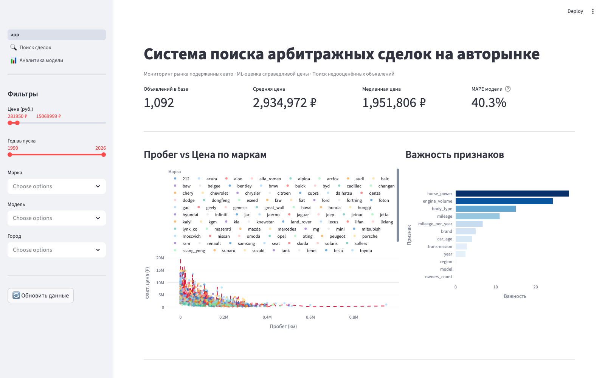

# 🚗 Car Market Arbitrage Analytics


Система предиктивной аналитики для поиска **арбитражных сделок** на рынке подержанных автомобилей: собирает **реальные объявления с auto.ru**, рассчитывает справедливую рыночную цену каждого авто через ML и выделяет объявления с необоснованно заниженной ценой — кандидатов на выгодную перепродажу. Каждая найденная сделка ведёт на настоящую страницу объявления.



## Возможности

- **ML-оценка справедливой цены** — CatBoost с категориальными фичами без ручного кодирования
- **Arbitrage Score** — взвешенная комбинация ценовой недооценки, ликвидности марки и динамики цены
- **SHAP-объяснения** — почему модель оценила конкретное авто именно так (нативные CatBoost ShapValues)
- **Детектор подозрительных объявлений** — IsolationForest отличает реальный арбитраж от ловушек (скрученный пробег, восстановленный VIN)
- **История цен** — продавец, снижающий цену, мотивирован продать быстро; это повышает score
- **Оценки сделок** — 🔥 Горячая / 👍 Хорошая / ⚠️ Подозрительная с уровнем надёжности предсказания
- **3 страницы дашборда** — обзор рынка, детальный поиск с SHAP, аналитика качества модели
- **Фоновое обновление** — APScheduler каждые 15 минут забирает свежайшие объявления по всей России и авто-переобучает модель

## Как это работает

```
[auto.ru (реальные объявления) / demo-источник]
        │  aiohttp + BeautifulSoup, retry (tenacity), семафор, UA-ротация
        ▼
scraper/parser.py + autoru.py ──► scraper/schemas.py ──► scraper/storage.py
   (async сбор)        (Pydantic-валидация,    (SQLAlchemy → SQLite,
                        drop невалидных)        dedup + price history)
        ▼
processing/preprocessor.py     ← дедупликация, отсев выбросов (квантили
        │                        в разрезе brand+model), feature engineering
        ▼
model/train.py                 ← CatBoostRegressor, early stopping,
        │                        метрики MAPE/RMSE → artifacts/
        ▼
model/predict.py               ← инференс + Arbitrage Score + SHAP
        │                        + IsolationForest + deal grading
        ▼
app/app.py (+ pages/)          ← Streamlit + Plotly: обзор, поиск, аналитика
```

### Arbitrage Score

```
Score = w1 · (P_pred − P_act) / P_pred + w2 · L + w3 · drop
```

| Компонент | Смысл |
|-----------|-------|
| `P_pred` | Справедливая цена по ML-модели |
| `P_act` | Фактическая цена объявления |
| `L` | Коэффициент ликвидности марки (1.2 для Toyota/Kia/Hyundai/BMW) |
| `drop` | Доля снижения цены с первого наблюдения (только если цена падала) |
| `w1=0.8, w2=0.2, w3=0.1` | Веса (настраиваются в `config.py`) |

Интерпретация: `Score > 0.3` — выгодная сделка, `0.1–0.3` — умеренная, `< 0.1` — рыночная цена.

## Быстрый старт

### Docker (одна команда)

```bash
docker compose up
# → init собирает данные и обучает модель, dashboard поднимается на :8501,
#   scheduler каждые 15 минут подтягивает свежие объявления и переобучает модель
```

### Локально

```bash
pip install -r requirements.txt

# собрать реальные объявления с auto.ru
SCRAPER_BASE_URL="https://auto.ru" python -m scraper.runner --pages 5

python -m model.train             # обучить модель
streamlit run app/app.py          # дашборд → http://localhost:8501

python -m scraper.scheduler       # автообновление каждые 15 мин + авто-переобучение
```

Auto.ru рендерит карточки на сервере, поэтому хватает aiohttp + BS4 (без headless-браузера).
Антибот пускает ~30–40 страниц за прогон; страницы с капчей пропускаются, а scheduler
докапливает данные между прогонами. Без `SCRAPER_BASE_URL` парсер работает в **demo-режиме**:
генерирует HTML-страницы листинга локально и прогоняет их через тот же BS4-парсинг
(включая отбрасывание битых карточек). Настройки — через переменные окружения (см. `.env.example`).

## Метрики модели

На реальных данных auto.ru (~10 900 объявлений, вся Россия, 780+ городов):

| Метрика | Значение |
|---------|----------|
| MAPE | ~14.6% (улучшена с 40% по мере накопления данных и тюнинга) |
| RMSE | ~1 200 000 ₽ (рынок от 35 тыс. до 50 млн ₽) |
| Размер обучения | 8057 train / 2015 val |
| Топ-признаки | `engine_volume`, `horse_power`, `body_type` |

Динамика MAPE: 40.3% (база, таргет в рублях) → 27.2% (лог-таргет) →
24.4% (5-fold CV + тюнинг) → **~14.6%** (рост датасета + по-сегментная калибровка по пробегу).

Страница **📊 Аналитика модели** показывает residuals, MAPE по маркам и scatter «предсказание vs факт».

## Тесты и качество

```bash
pytest tests/ -v        # 119 тестов: схемы, парсеры (вкл. auto.ru), препроцессинг, скоринг, storage
ruff check .            # линтер (конфиг в ruff.toml)
```

CI (GitHub Actions): lint → тесты → smoke скрапера → smoke обучения.

## Tech Stack

**Python 3.10+** · **aiohttp + BeautifulSoup4** (async-скрапинг) · **Pydantic v2** (валидация) · **SQLAlchemy + SQLite** (хранение; PostgreSQL через `DATABASE_URL`) · **pandas** (обработка) · **CatBoost** (регрессия + SHAP) · **scikit-learn** (IsolationForest) · **Streamlit + Plotly** (дашборд) · **APScheduler** (фоновые задачи) · **pytest + ruff** (качество) · **Docker Compose** (деплой)

## Структура проекта

```
├── scraper/        # async-парсер, auto.ru-парсер, Pydantic-схемы,
│                   # persistence + price history, demo-источник, scheduler
├── processing/     # DataPreprocessor: dedup, выбросы, feature engineering
├── model/          # обучение CatBoost, инференс, скоринг, SHAP, метрики
├── app/            # Streamlit: главная + pages/ (Поиск сделок, Аналитика модели)
├── tests/          # 119 тестов + фикстуры (вкл. реальный HTML auto.ru)
├── config.py       # единый источник настроек (+ env overrides)
├── Dockerfile      # python:3.11-slim, non-root, healthcheck
└── docker-compose.yml  # init (seed+train) → dashboard + scheduler
```
